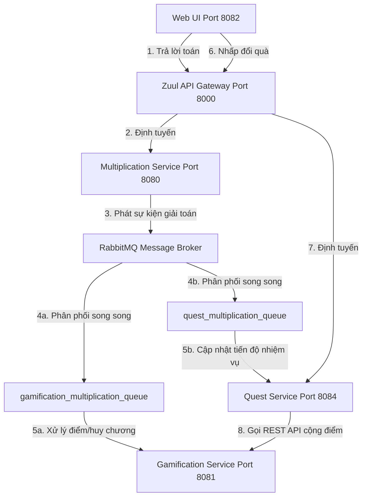

# 🌟 HỆ THỐNG MICROSERVICES - TRÒ CHƠI "CUỘC ĐUA PHÉP NHÂN"

Dự án này là phiên bản nâng cấp toàn diện và tối ưu hóa hệ thống microservices của trò chơi giáo dục toán học **"Cuộc Đua Phép Nhân" (Social Multiplication & Gamification)** chạy trên nền tảng **Java 17** và **Spring Boot 2.0**. Hệ thống được thiết kế theo các tiêu chuẩn kiến trúc phần mềm phân tán tiên tiến, ứng dụng cơ chế giao tiếp hướng sự kiện (Event-Driven) và tích hợp các tính năng tự động xoay vòng nhiệm vụ độc đáo.

---

## 🗺️ 1. Bản Đồ Kiến Trúc Hệ Thống (Logical View)

Hệ thống được chia thành nhiều dịch vụ chạy độc lập, tự quản lý nghiệp vụ và cơ sở dữ liệu (Database) riêng biệt:



### Chi tiết vai trò từng thư mục dịch vụ:
1.  **`service-registry` (Cổng 8761):** Eureka Service Discovery Server, giúp các microservice tự động đăng ký và tìm thấy nhau trong mạng nội bộ.
2.  **`gateway` (Cổng 8000):** Zuul API Gateway, điểm tiếp nhận duy nhất cho toàn bộ các yêu cầu từ Client, tích hợp cơ chế định tuyến (Routing) và tự động cân bằng tải (Load Balancing) với Ribbon.
3.  **`social-multiplication` (Cổng 8080):** Dịch vụ quản lý người dùng, tạo câu hỏi phép nhân và tiếp nhận bài giải của học sinh. Sau mỗi bài giải, dịch vụ này sẽ phát ra một sự kiện (Event) lên RabbitMQ.
4.  **`gamification` (Cổng 8081):** Dịch vụ trò chơi hóa. Lắng nghe sự kiện từ RabbitMQ để tự động cộng điểm, xếp hạng và trao huy chương (Badges) cho học sinh.
5.  **`quest-service` (Cổng 8084 - MICROSERVICE MỚI):** Dịch vụ quản lý **30 Thử thách xoay vòng tuần hoàn** chia làm 3 cấp độ (Dễ, Trung bình, Khó). Chỉ theo dõi và tích lũy tiến trình cho các thử thách đang hiển thị trên giao diện người chơi, tự động reset tuần hoàn khi người chơi vượt qua chuỗi 10 nhiệm vụ của cấp độ tương ứng.
6.  **`ui` (Cổng 8082):** Giao diện Web hiển thị game, bảng xếp hạng và danh sách thử thách thời gian thực được thiết kế theo phong cách Brutalism táo bạo và bắt mắt.
7.  **`tests_e2e`:** Bộ công cụ kiểm thử tự động toàn diện tích hợp Cucumber (ngôn ngữ Gherkin).

---

## 🛠️ 2. Yêu Cầu Chuẩn Bị Hệ Thống (Prerequisites)

Để hệ thống khởi chạy trơn tru, máy tính của bạn cần được cài đặt sẵn các công cụ sau:
*   **Java 17 SDK** (Đảm bảo biến môi trường `JAVA_HOME` đã trỏ đúng phiên bản Java 17).
*   **RabbitMQ Server** (Để làm Message Broker cho giao tiếp hướng sự kiện bất đồng bộ). Đảm bảo dịch vụ RabbitMQ đang hoạt động ở cổng mặc định `5672` (hoặc cổng quản trị `15672`).

---

## 🚀 3. Quy Trình Khởi Chạy Hệ Thống Chi Tiết (Cho Giáo Viên)

Để kiểm tra và chạy thử ứng dụng một cách dễ dàng nhất, vui lòng mở các tab PowerShell (hoặc Terminal) độc lập và chạy theo đúng thứ tự các bước dưới đây:

### Bước 1: Khởi động RabbitMQ Server (Qua Docker)
Để khởi động nhanh RabbitMQ mà không cần cài đặt cấu hình phức tạp:
1. Mở PowerShell/Terminal tại thư mục gốc của dự án (nơi chứa tệp `docker-compose.yml`).
2. Chạy câu lệnh để tự động tải và kích hoạt RabbitMQ chạy ngầm:
   ```powershell
   docker-compose up -d
   ```
3. *Bạn có thể truy cập trang quản trị RabbitMQ tại địa chỉ: `http://localhost:15672` (Tài khoản: `guest` / Mật khẩu: `guest`) để theo dõi hàng đợi tin nhắn.*

### Bước 2: Khởi động Eureka Registry (Trung tâm Đăng ký Dịch vụ)
1. Mở PowerShell/Terminal mới và di chuyển vào thư mục:
   ```powershell
   cd service-registry
   ```
2. Chạy lệnh để khởi động:
   * **Trên Windows:** `.\mvnw.cmd spring-boot:run`
   * **Trên Linux/macOS:** `./mvnw spring-boot:run`
3. *Đợi khoảng 5-10 giây cho đến khi terminal báo ứng dụng đã chạy thành công trên cổng `8761`.*

### Bước 3: Khởi động Zuul API Gateway (Cổng Định Tuyến)
1. Mở PowerShell/Terminal mới:
   ```powershell
   cd gateway
   ```
2. Chạy lệnh khởi động:
   * **Trên Windows:** `.\mvnw.cmd spring-boot:run`
   * **Trên Linux/macOS:** `./mvnw spring-boot:run`
3. *Chờ Gateway khởi chạy thành công trên cổng `8000`.*

### Bước 4: Khởi động Dịch vụ Multiplication
1. Mở PowerShell/Terminal mới:
   ```powershell
   cd social-multiplication
   ```
2. Chạy lệnh khởi động:
   * **Trên Windows:** `.\mvnw.cmd spring-boot:run`
   * **Trên Linux/macOS:** `./mvnw spring-boot:run`
3. *Chờ dịch vụ chạy thành công trên cổng `8080`.*

### Bước 5: Khởi động Dịch vụ Gamification
1. Mở PowerShell/Terminal mới:
   ```powershell
   cd gamification
   ```
2. Chạy lệnh khởi động:
   * **Trên Windows:** `.\mvnw.cmd spring-boot:run`
   * **Trên Linux/macOS:** `./mvnw spring-boot:run`
3. *Chờ dịch vụ chạy thành công trên cổng `8081`.*

### Bước 6: Khởi động Dịch vụ Quest (Nhiệm vụ Thử thách Mới)
1. Mở PowerShell/Terminal mới:
   ```powershell
   cd quest-service
   ```
2. Chạy lệnh khởi động:
   * **Trên Windows:** `.\mvnw.cmd spring-boot:run`
   * **Trên Linux/macOS:** `./mvnw spring-boot:run`
3. *Chờ dịch vụ chạy thành công trên cổng `8084`.*

### Bước 7: Khởi động Giao Diện Người Dùng (Web UI)
Để khởi động giao diện người dùng đơn giản và tiện lợi nhất mà không cần cài đặt Jetty phức tạp:
1. Mở PowerShell/Terminal mới và di chuyển vào thư mục chứa mã nguồn tĩnh UI:
   ```powershell
   cd ui/webapps/ui
   ```
2. Chạy dịch vụ web tĩnh nhanh bằng **Python** (Cổng 8082):
   ```powershell
   python -m http.server 8082
   ```
   *(Nếu dùng macOS hoặc máy đã cài Python 3, hãy chạy: `python3 -m http.server 8082`)*.
3. Mở trình duyệt Web và truy cập: **`http://localhost:8082`** để bắt đầu trải nghiệm game!

---

## 🎮 4. Kịch Bản Trải Nghiệm Thực Tế (Demo Flow)

Để tự tin trình diễn các tính năng phân tán đỉnh cao của hệ thống trước Hội đồng/Giáo viên, hãy thực hiện theo kịch bản hấp dẫn sau:

1.  **Đăng ký và Làm Toán:**
    *   Tại trang chủ `http://localhost:8082`, nhập một biệt danh mới (Ví dụ: `thanh_cong`) và bấm gửi để bắt đầu làm phép tính.
    *   Hệ thống sẽ hiển thị bảng câu hỏi, Bảng điểm cá nhân và Bảng xếp hạng tức thì.
2.  **Kích Hoạt Giao Diện Nhiệm Vụ Động:**
    *   Ngay dưới bảng điểm cá nhân, một khung giao diện màu xanh neon cực đẹp mang tên **"Thử Thách Nhận Thưởng (Quests)"** sẽ tự động trượt ra.
    *   Tại đây hiển thị **3 thử thách active** tương ứng với 3 mức độ điểm:
        *   **Cấp Dễ (+20đ):** *Khởi đầu nhẹ nhàng* (Giải đúng 3 phép tính).
        *   **Cấp Trung Bình (+50đ):** *Bản lĩnh trung cấp* (Giải đúng 8 phép tính).
        *   **Cấp Khó (+100đ):** *Đỉnh cao thử thách* (Giải đúng 18 phép tính).
3.  **Xem Tiến Trình Tự Động:**
    *   Hãy trả lời đúng 3 câu liên tiếp. Bạn sẽ thấy thanh tiến trình của thử thách cấp Dễ tăng lên `100% hoàn thành` và nút **[ Nhận +20đ ]** màu cam bắt đầu nhảy nhót nảy lên cực kỳ sinh động!
4.  **Bấm Nhận Quà & Hiệu Ứng Xoay Vòng Thử Thách (Conveyor Board):**
    *   Hãy nhấp nút **[ Nhận ]** $\rightarrow$ Bạn sẽ thấy điều kỳ diệu: Thử thách cũ biến mất, và thử thách kế tiếp trong kho là **"Chuỗi khởi động" (đạt streak 3 câu đúng)** tự động trượt vào thế chỗ mượt mà!
    *   Bảng xếp hạng hiển thị điểm số của `thanh_cong` tăng thêm 20 điểm thưởng tức thì!
5.  **Xác Minh Tính Công Bằng:**
    *   Dữ liệu chỉ tích lũy cho nhiệm vụ đang active. Bạn không thể gián tiếp tích lũy điểm cho các nhiệm vụ nâng cao ở phía sau khi chưa mở khóa tới chúng.
6.  **Xoay Vòng Tuần Hoàn:**
    *   Sau khi vượt qua toàn bộ 10 thử thách của nhóm Dễ, hệ thống sẽ tự động đưa bạn quay lại thử thách số 1 để tiếp tục hành trình tích điểm vô tận!
